<div align="center">

<picture>
  <source media="(prefers-color-scheme: dark)" srcset="assets/hero-dark.svg">
  <source media="(prefers-color-scheme: light)" srcset="assets/hero-light.svg">
  
</picture>

<br><br>


[](https://vaibhavreddy.vercel.app)
[](https://www.linkedin.com/in/vaibhav-reddy-982b0a25b/)
[](mailto:vaibhav.reddy560@gmail.com)

</div>

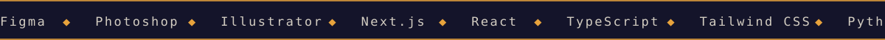

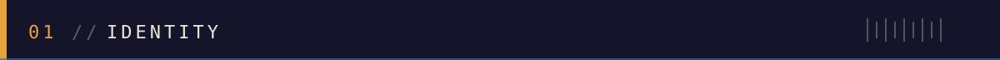

> [!NOTE]
> **I design the thing and then I build it.** Posters and event identities for IEEE and BMSCE by
> day, AI-powered web products the rest of the time.

I'm a third-year **Artificial Intelligence and Machine Learning** student at **B.M.S. College of
Engineering**, Bengaluru. I sit in the overlap between two things that usually live in different
people: the visual side — branding, identity, UI/UX, posters that have to work at A3 and on a
phone — and the engineering side — Next.js, React, TypeScript, Python, and AI systems that have
to actually hold up when someone uses them.

Most of what I build starts as a design problem. Easy Club began because student organisations
were running on scattered spreadsheets. Opacitys began because design feedback is almost always
someone's opinion rather than a measurement. SatQuery began because reading satellite imagery
normally requires GIS expertise most people don't have. In each case the interesting part wasn't
the model or the framework — it was deciding what the thing should *be*.

Outside coursework I'm a **Student Activities Committee Coordinator** for the **IEEE Bangalore
Section** and the **IEEE Computer Society Bangalore Chapter**, where I run design direction for
section-level student programming, and I've coordinated hackathons at the scale of a few hundred
participants.

```
OPERATOR ......... Vaibhav Reddy
ROLE ............. Designer & AI/ML engineer
STUDYING ......... B.E. Artificial Intelligence & Machine Learning
INSTITUTION ...... B.M.S. College of Engineering, Bengaluru
GRADUATING ....... 2028
FOCUS ............ Product design · AI applications · Branding & identity
CURRENTLY ........ Shipping Opacitys · designing for IEEE & UTSAV 2026
STATUS ........... Open to opportunities
```


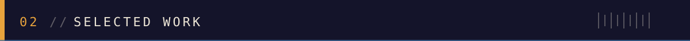

### Easy Club · Club operations made easy

`2025 — Present` &nbsp;·&nbsp; **[easyclub.in ↗](https://easyclub.in)** &nbsp;·&nbsp; [Source ↗](https://github.com/Vaibhav-Reddy560/Easy-Club)

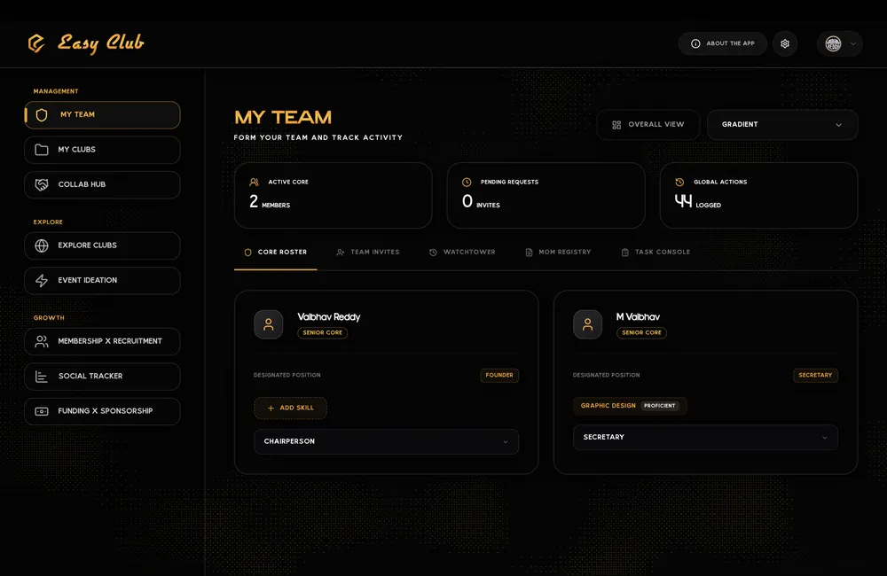

A centralised command centre for student organisations, technical chapters and university clubs —
replacing scattered spreadsheets and disconnected group chats with one operational workspace.
Event orchestration, generative AI ideation and design, recruitment, sponsorship CRM and
role-based access, all in one place.


<details>
<summary><b>Inside the build</b> — three pillars</summary>

<br>

**Event Command Center** — the hub for orchestrating hackathons, tech summits and club events end to end.

- Tracks upcoming, postponed and completed events in one board
- Logs meeting minutes against each event
- Domain-scoped task assignment — Management, Design, Content, Social — with live completion metrics
- Intelligent Workspaces automate registration by syncing directly with Google Forms
- Built-in QR scanner for real-time check-in at the door
- Semantic search so members find events and clubs in natural language

**AI Ideation & Design Studio** — native generative AI across OpenAI, Gemini and HuggingFace, aimed at the parts of the work that stall.

- Event ideation engine brainstorms trending concepts and drafts pitches, titles and preliminary operational reports
- Native Design Studio with an "AI Vibe Director" suggesting colour palettes and typography
- Generates and exports social assets, A3 posters, standees and certificates in-app
- Invitation Engine drafts outreach emails, social captions, WhatsApp templates and volunteer briefings

**CRM, Recruitment & Access** — the governance layer that lets an organisation scale without losing control.

- Role-based access across System Administrator, Senior Core, Junior Core and General Member
- Watchtower dashboard monitors permissions and activity
- Recruitment pipeline with applicant tracking, a "Talent Matrix" skill evaluation and internal core committee voting
- Sponsorship CRM — a Kanban board tracking prospects through to close, funding tiers and deliverable fulfilment
- Collaboration Hub for secure inter-club comms and MOU drafting

</details>

---

### Opacitys · An AI creative workspace for designers

`2026` &nbsp;·&nbsp; **[opacitys.vercel.app ↗](https://opacitys.vercel.app)** &nbsp;·&nbsp; [Source ↗](https://github.com/Vaibhav-Reddy560/Opacitys) &nbsp;·&nbsp; *Built solo*

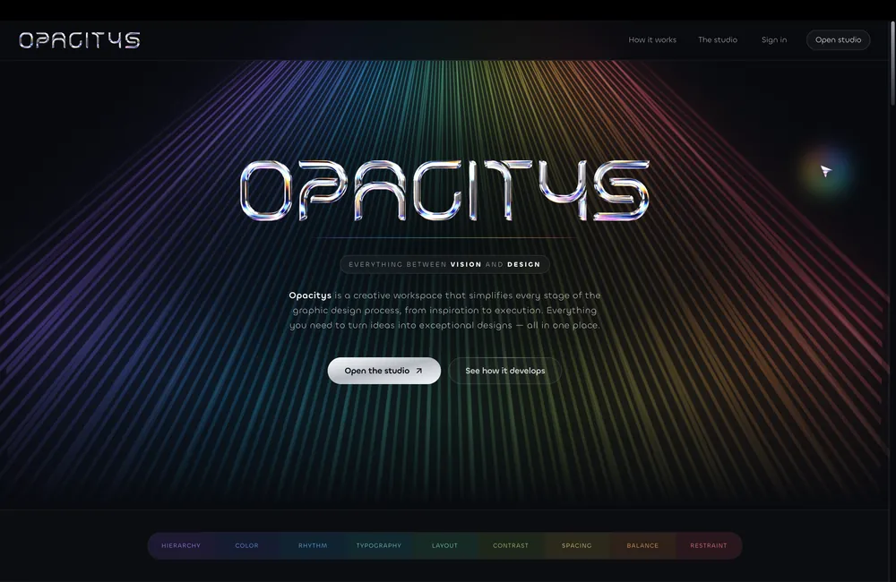

Replace subjective design feedback with something measured or sourced. Every module either takes
a real measurement or cites a real page — nothing is a confident guess dressed up as an answer.
Ten modules covering pixel-level critique, verified scoped edits, percentage style blends and
live-web-grounded trend research.


<details>
<summary><b>Inside the build</b> — ten modules</summary>

<br>

| Module | What it does |
| :--- | :--- |
| **Critique** | Measures nine design dimensions at pixel level — contrast ratios, type scale, alignment, spacing rhythm — then narrates what each number means. Every finding is pinned to its exact location on the image. |
| **Rebuild** | Detects a design's real element structure via vision grounding, then edits any element from a plain-language description. Edits are scoped and verified by pixel-diffing the before/after rather than trusting the model's claim. |
| **Identify** | Classifies a design against a curated 100+ item style taxonomy. Returns a percentage blend — 60% Swiss, 30% brutalist, 10% editorial — rather than one guessed label. |
| **Currents** | Live-web-grounded trend research: Tavily search feeding a Groq synthesis pass. Returns named, dated trends with citations validated against the pages actually retrieved. |
| **Route** | Turns a client brief plus your tools and skill level into an ordered, tool-by-tool execution plan. Multi-turn follow-ups can revise the plan itself. |
| **Instruments** | Answers "where is that control" from an attached screenshot, or by searching live docs and changelogs — avoiding stale knowledge about UI that has since moved. |
| **Correspondence** | Logs a client relationship — every message, channel, iteration and price — and interprets any entry back into concrete next moves and a draft reply. |
| **Originality** | Checks how crowded a proposed direction already is against documented movements and prior work, names the closest neighbours, and suggests moves to widen the gap. |
| **Fingerprint** | Aggregates every Critique, Identify and Originality run into one longitudinal style profile. Says when a dimension lacks enough signal instead of faking a zero score. |
| **Clearance** | Answers licensing and public-domain questions with durable principles, plus a country-aware read on a specific asset — always flagged as guidance, never legal advice. |

**Provider orchestration** — Groq · Google Gemini · Tavily · Cloudflare Workers AI · Pollinations.ai

**Engineering notes**

- Five AI/search providers orchestrated with rate-limit-aware budget tracking and automatic fallback
- Deliberately engineered to stay on genuinely free tiers — no credit card required anywhere
- Deterministic text replacement using opentype.js glyph outlines instead of generative inpainting, so text edits are exact
- Daily-refreshing trend digest generated server-side with database-level concurrency guards instead of cron infrastructure
- Unified "Your Work" library with cross-feature filtering, and Google OAuth via Firebase
- One ordered colour spectrum maps the nine measured dimensions consistently across every screen

</details>

---

### SatQuery AI · Conversational satellite intelligence

`2026` &nbsp;·&nbsp; **[satquery-ai-sih.vercel.app ↗](https://satquery-ai-sih.vercel.app/)**

Make satellite-image analysis as simple as asking a question. SatQuery combines a
remote-sensing-adapted vision-language model, specialist analysis models, GIS tools and an agentic
controller to translate natural-language queries into the correct analytical workflow. Rather than
leaning on a single generic model, it validates the imagery, selects the appropriate model or tool,
performs the analysis, verifies the evidence, and produces an interpretable answer with visual
evidence and an auditable execution trace.


<details>
<summary><b>Inside the build</b> — pipeline and modules</summary>

<br>

**The pipeline**

```
query parsing → input validation → task classification → model/tool selection
   → analysis → verification → evidence aggregation → response generation
```

| Module | Role |
| :--- | :--- |
| **Query Understanding** | Converts natural-language requests into structured analytical intents and identifies required inputs. |
| **Input Validation** | Checks image type, resolution, bands, timestamps, geospatial metadata, and whether the imagery is sufficient for the requested task. |
| **Model and Tool Router** | Selects the appropriate VLM, specialist model, GIS operation, or combination of tools based on the query. |
| **VLM Analysis** | Satellite-image interpretation, visual question answering, object and region understanding, natural-language visual reasoning. |
| **GIS Analysis Engine** | Deterministic geospatial operations — coordinate handling, distance and area calculations, raster processing, spatial queries, derived-index computation. |
| **Bi-Temporal Change Analysis** | Compares imagery of the same region acquired at different times to identify and explain meaningful changes. |
| **Optical-SAR Fusion** | Combines complementary optical and SAR observations where a single modality is insufficient. |
| **Evidence & Response Generator** | Combines model outputs and tool results into an interpretable answer with visual evidence, confidence information and an execution trace. |

**Data sources** — Sentinel-1, Sentinel-2, Landsat and other compatible remote-sensing datasets.

**Why it's not just a chatbot for satellite images:** tool-based deterministic calculations, input
validation, confidence checks, provenance tracking and explicit evidence are used to reduce
hallucination and make results reproducible. It decides what to analyse, how to analyse it, and
shows why its answer can be trusted.

</details>

---

### This Portfolio · A portfolio you operate

`2026` &nbsp;·&nbsp; **[vaibhavreddy.vercel.app ↗](https://vaibhavreddy.vercel.app)** &nbsp;·&nbsp; [Source ↗](https://github.com/Vaibhav-Reddy560/Portfolio_Website)

A portfolio should demonstrate the work, not just describe it. So this one is built as a machine
you operate rather than a page you scroll: every section is a window you can drag, minimise and
close, a live diagnostic readout reports real telemetry from the DOM, and the whole thing is
edited through its own private portal — including signing in with your face.


<details>
<summary><b>Inside the build</b> — five pillars</summary>

<br>

**A window manager, not a scroll page** — every section is a real window with its own controls.

- Drag any window by its title bar and it lifts out of the document flow entirely
- Minimise to collapse a window to its title bar, or close it outright and restore it later
- Dragged windows re-dock back into the layout, and focusing one raises it above the rest
- Drag positions are clamped to the viewport, so a window can never be dropped out of reach
- Reduced-motion and touch are respected — dragging is disabled where it would get in the way

**Live diagnostics from the real DOM** — the HUD reports genuine telemetry, not decorative numbers.

- Active module tracked by a scroll-spy over the real section elements
- Scroll depth computed from live document and client height
- Pointer coordinates and viewport dimensions updated as you move and resize
- The readout is itself a draggable window, and collapses when you want it gone

**Self-serve content portal** — every project, design, role and skill is edited through a private admin, not by redeploying.

- Backed by Supabase Postgres, with row-level security scoping every write to a single operator account
- Projects, designs, experience, skills, education and profile are all editable in place
- AI-assisted drafting turns rough notes into structured case-study content ready to refine
- Uploads keep the full-resolution original and generate their own blur placeholders
- Published changes revalidate the public site without a rebuild

**Face ID sign-in** — the portal can be unlocked by camera on any device, not just one with a fingerprint reader.

- Face recognition runs entirely in the browser — no image is ever uploaded
- Enrollment walks through five head positions and stores a multi-view model, matched against the closest view
- A passive liveness check watches for the involuntary motion a real face has, so a photograph does not pass
- Landmarks are normalised for position, scale and rotation, so waving a printed photo cancels out
- Stored descriptors are readable only by trusted server code, never by any browser session
- Runs on the TensorFlow.js WASM backend, which starts in a fraction of a second where WebGL took seconds

**Details that only show up in use** — the parts that are invisible when they work.

- The boot sequence is engineered so not one frame of the site paints before it
- Returning within a session skips the animation entirely, with no reverse flash
- Custom display faces, a blueprint-and-bone palette, and hardware ornament drawn as inline SVG
- Zero horizontal overflow from 390px to desktop, verified rather than assumed

</details>


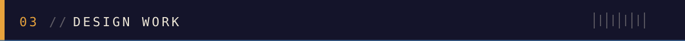

Posters, identities, badge systems and event collateral — most of it for **BMSCE IEEE Computer
Society**, **IEEE Bangalore Section**, **Phase Shift** and **UTSAV 2026**. Built in Photoshop,
Illustrator, Figma and Canva, and produced for print as well as screen.

<table>
  <tr>
    <td align="center" width="25%">
      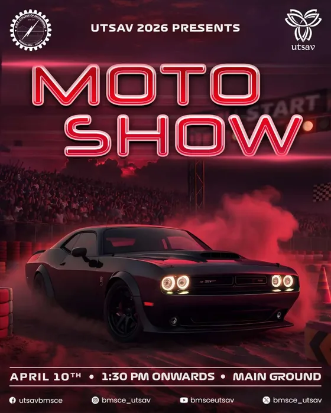<br>
      <b>Moto Show</b><br>
      <sub>UTSAV 2026 · Event poster</sub>
    </td>
    <td align="center" width="25%">
      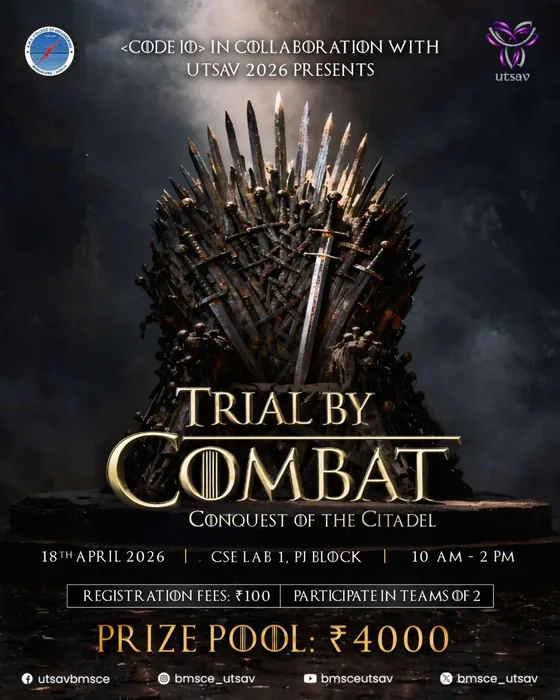<br>
      <b>Trial by Combat</b><br>
      <sub>Code IO × UTSAV 2026 · Event poster</sub>
    </td>
    <td align="center" width="25%">
      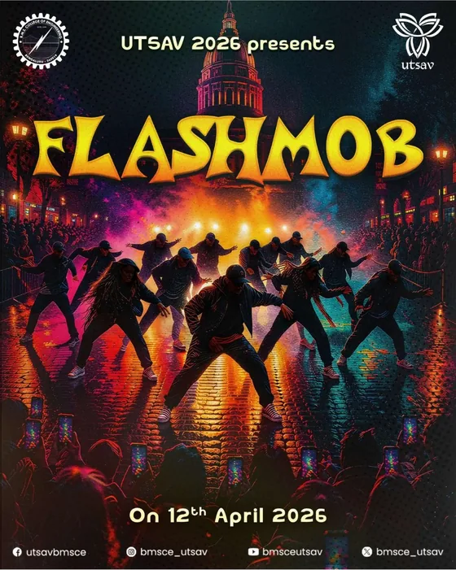<br>
      <b>Flashmob</b><br>
      <sub>UTSAV 2026 · Event poster</sub>
    </td>
    <td align="center" width="25%">
      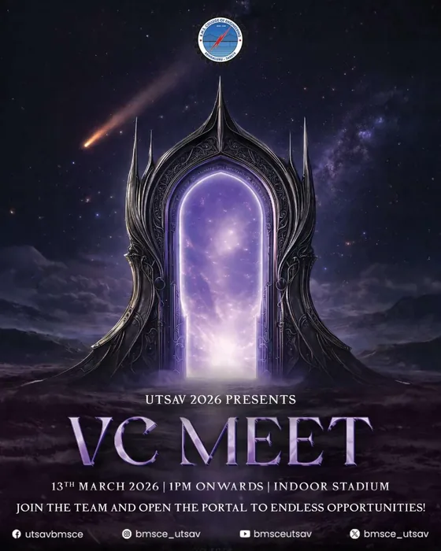<br>
      <b>VC Meet</b><br>
      <sub>UTSAV 2026 · Event poster</sub>
    </td>
  </tr>
  <tr>
    <td align="center" width="25%">
      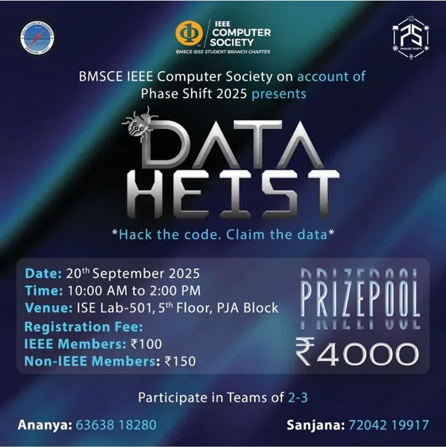<br>
      <b>Data Heist</b><br>
      <sub>Phase Shift 2025 · Event poster</sub>
    </td>
    <td align="center" width="25%">
      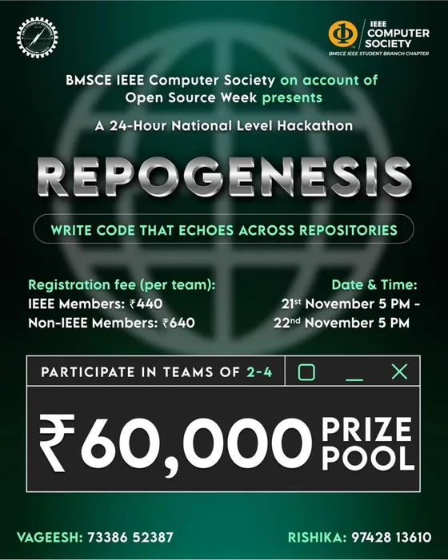<br>
      <b>RepoGenesis</b><br>
      <sub>Open Source Week · Hackathon poster</sub>
    </td>
    <td align="center" width="25%">
      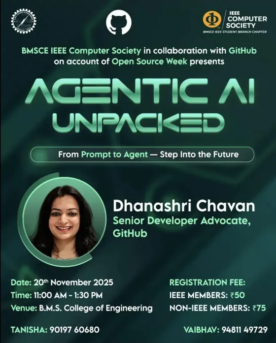<br>
      <b>Agentic AI Unpacked</b><br>
      <sub>BMSCE IEEE CS × GitHub · Speaker session</sub>
    </td>
    <td align="center" width="25%">
      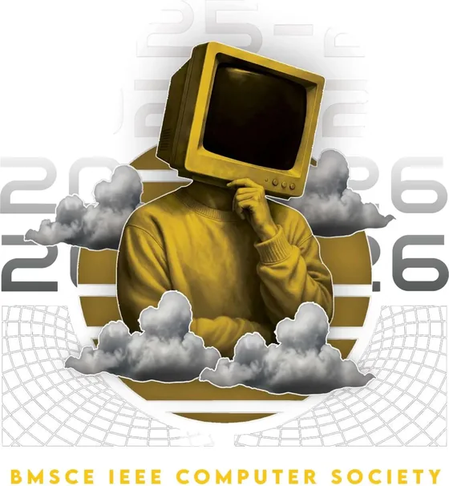<br>
      <b>Chapter Identity 2026</b><br>
      <sub>BMSCE IEEE CS · Identity graphic</sub>
    </td>
  </tr>
</table>

<details>
<summary><b>The full set</b> — 22 pieces</summary>

<br>

| Piece | Context | Kind | Year |
| :--- | :--- | :--- | :--- |
| Inauguration & Artist Lineup | UTSAV 2026 | Poster series | 2026 |
| DJ Night | UTSAV 2026 | Event poster | 2026 |
| Flashmob | UTSAV 2026 | Event poster | 2026 |
| Moto Show | UTSAV 2026 | Event poster | 2026 |
| VC Meet | UTSAV 2026 | Event poster | 2026 |
| Faculty's Got Talent | UTSAV 2026 | Event poster | 2026 |
| Trial by Combat | Code IO × UTSAV 2026 | Event poster | 2026 |
| Certificate of Appreciation | UTSAV 2026 | Certificate | 2026 |
| Chapter Identity 2026 | BMSCE IEEE CS | Identity graphic | 2026 |
| Student Chairs Meet Up | IEEE CS Bangalore Chapter | Event poster | 2026 |
| Tech for Good Summit | BMSCE IEEE CS × WIE | Teaser poster | 2026 |
| Easy Club Launch | Easy Club | Product poster | 2025 |
| Agentic AI Unpacked | BMSCE IEEE CS × GitHub | Speaker session | 2025 |
| RepoGenesis | Open Source Week | Hackathon poster | 2025 |
| Open Source Week | BMSCE IEEE CS | Type lockup | 2025 |
| Data Heist | Phase Shift 2025 | Event poster | 2025 |
| Holoverse 360 | BMSCE IEEE CS | Workshop poster | 2025 |
| WattWeb | PES Day 2025 | Event poster | 2025 |
| Out Campus Campaigning | Phase Shift | Event poster | 2025 |
| Volunteer Badge | Hackaphasia | Badge system | 2025 |
| Executive Committee Badge | Hardware Hackathon III | Badge system | 2025 |
| Meridian Core Badge | Phase Shift 2025 | Badge system | 2025 |

</details>


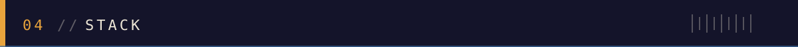

**Design & Multimedia**


**Build**


**AI & Data**


**Infrastructure**


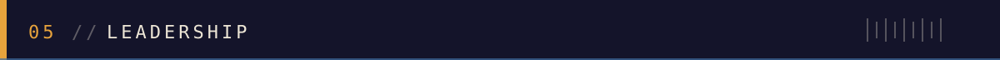

| Period | Role | Organisation |
| :--- | :--- | :--- |
| **Feb 2026 — Present** | SAC Coordinator — Design | IEEE Bangalore Section · IEEE CS Bangalore Chapter |
| **Feb 2026 — Present** | Design JC | BMSCE UTSAV — annual cultural fest |
| **Dec 2024 — Present** | Event Designer & Organizer | BMSCE IEEE PES and Sensors Council |
| **Sep 2025 — Mar 2026** | Central Event Coordinator — Hackaphasia 3.0 | BMSCE Phase Shift, with BMSCE IEEE CS |
| **Jul 2025 — Nov 2025** | SAC Coordinator | BMSCE IEEE Computer Society |
| **Jan 2025 — Jul 2025** | Multimedia Team Member | BMSCE IEEE Computer Society |
| **2024** | Representing Ambassador — IEEE DataPort | ICWITE Conference, IEEE Bangalore Section |

A few of those in more detail: as **SAC Coordinator for Design** I was selected by the IEEE
Bangalore Section to own visual direction for section-level student programming. As **Central
Event Coordinator for Hackaphasia 3.0** I ran BMSCE's largest hackathon — 350+ participants across
a 24-hour cycle — owning logistics and crisis management end to end.

**Also involved in** — Rotaract Club of BMSCE (community service) · BMSCE Pentagram social media
team (2024–25) · Phase Shift 2025 design team · IEEE INDICON conference volunteer · hackathon
volunteering across college-level technical competitions.


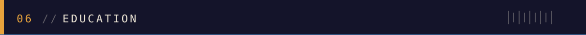

| Qualification | Institution | Period |
| :--- | :--- | :--- |
| **B.E. — Artificial Intelligence & Machine Learning** | B.M.S. College of Engineering, Bengaluru | 2024 — Expected 2028 |
| Pre-University — Science | BASE PU College, Bengaluru | Completed 2024 |
| Secondary School — CBSE | GEAR Innovative International School, Bengaluru | Completed 2022 |


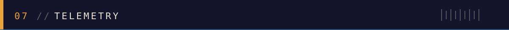

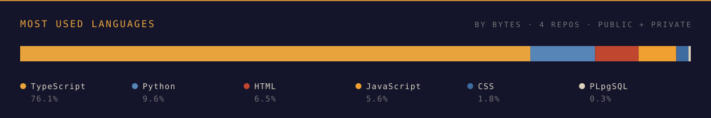

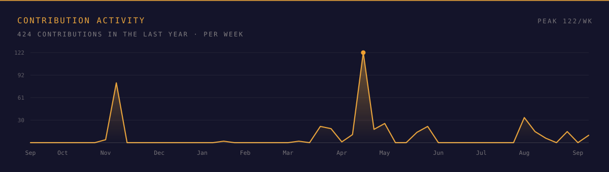

<sub>Measured from the GitHub API and drawn here rather than pulled from a stats service — the usual
ones were returning 503 and 402 while this was being built, which renders as a broken image.</sub>


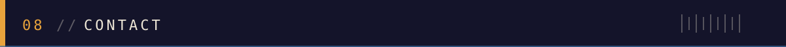

Open to design work, internships and product builds. The fastest way to reach me is email.

<div align="center">

[](https://vaibhavreddy.vercel.app)
[](https://www.linkedin.com/in/vaibhav-reddy-982b0a25b/)
[](mailto:vaibhav.reddy560@gmail.com)
[](https://easyclub.in)

</div>

<br>

> [!TIP]
> This README is built the same way my site is — the banner, ticker, plates and rules above are
> hand-authored animated SVG in the same palette, with the headline set in the same display face.
> The full machine is at **[vaibhavreddy.vercel.app](https://vaibhavreddy.vercel.app)**.

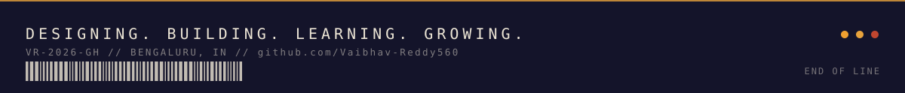
